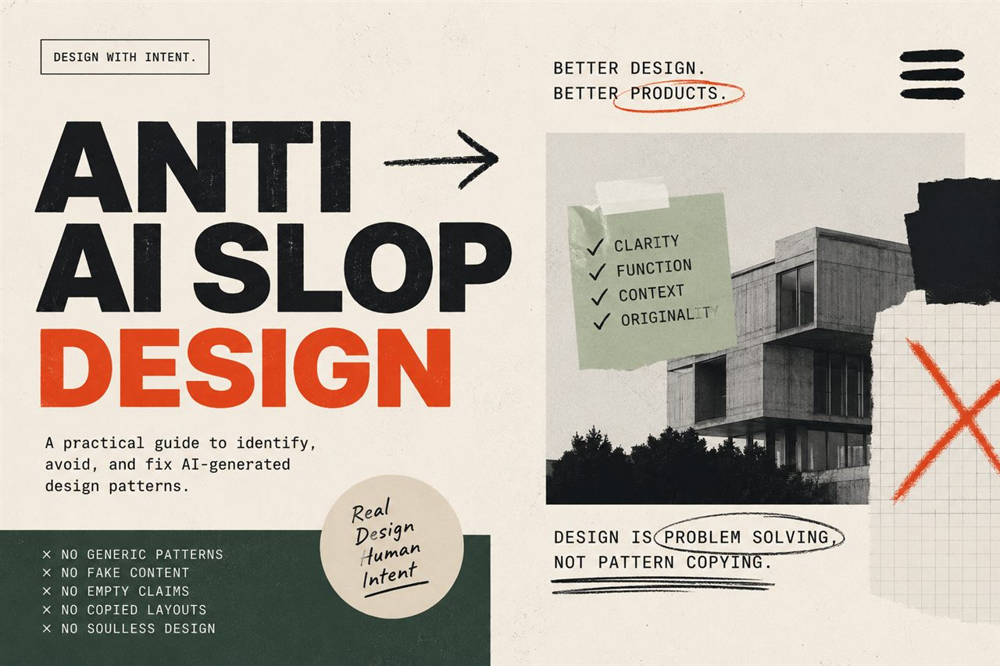
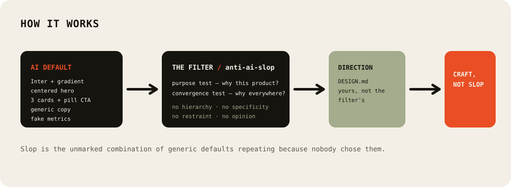
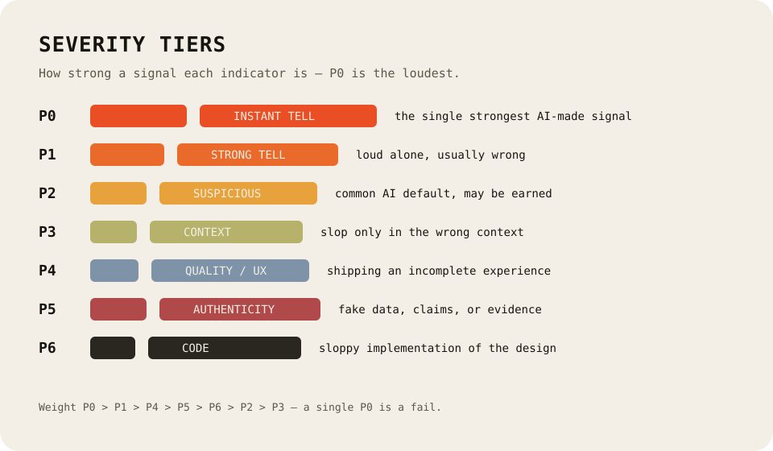

<div align="center">


# anti-ai-slop

**Anti Slop: Rules for AI Coding Agents.**

A filter that stops AI agents from generating generic **AI slop** in UI, copy, and code — without turning the result sterile.

**A filter, not a style guide.** It rejects *technique without purpose*, not the techniques themselves.

&nbsp;

[](LICENSE)
[](https://github.com/muris11/anti-ai-slop/actions/workflows/ci.yml)
[](#)
[](https://www.skills.sh/muris11/anti-ai-slop)
[](https://github.com/muris11/anti-ai-slop)

**17 skills · one always-on filter · 7 agents · 3 platforms**

<a href="images/anti-ai-slop-banner.jpg"></a>

</div>

&nbsp;

> **Language:** **English** · [Bahasa Indonesia](README.id.md)

---

## Overview

`anti-ai-slop` is a **filter** for AI coding agents. It tells them to stop producing the *default AI look* — the purple gradient, the centered hero, the three identical cards, the "unlock the power" copy, the fake metrics — **without imposing a single fixed aesthetic.**

The core idea, in four words:

> **No hierarchy + no specificity + no restraint + no opinion.**

AI slop isn't any one technique. A gradient is fine. A card grid is fine. Inter is fine. **Slop is the unmarked combination** of generic defaults that repeat because nobody made a decision. The two tests used throughout:

1. **Purpose test** — can you write one honest sentence explaining why this technique serves *this* product?
2. **Convergence test** — does the same technique appear across unrelated screens for no reason?



---

## What's inside

**17 skills**, grouped as:

| Area | Skills |
|---|---|
| **Core filter** | `antislop` — always on |
| **Master catalog** | `antislop-master` — the P0–P6 indicator audit |
| **Visual & layout** | `antislop-ui` · `antislop-layout` · `antislop-imagery` · `antislop-designsystem` |
| **Copy & content** | `antislop-copywriting` · `antislop-authenticity` |
| **Product & UX** | `antislop-dashboard` · `antislop-forms` · `antislop-motion` · `antislop-nav` |
| **People & platform** | `antislop-human` · `antislop-layoutmobile` · `antislop-mobile` |
| **Code** | `antislop-code` |
| **Loader** | `slop` — loads the whole family at once |

### The master taxonomy

`antislop-master` is a **severity-tiered catalog** of ~180 indicators spanning color, typography, layout, components, copy, motion, UX states, authenticity, code, and platform. Every indicator is rated by how strong a signal it is:

| Tier | Meaning |
|---|---|
| **P0** | Instant AI tell — the single strongest signal |
| **P1** | Strong tell — individually loud, usually wrong |
| **P2** | Suspicious pattern — common AI default, may be earned |
| **P3** | Context dependent — only slop in the wrong context |
| **P4** | Quality / UX slop — shipping an incomplete experience |
| **P5** | Authenticity slop — fake data, claims, or evidence |
| **P6** | Code slop — sloppy implementation of the design |



The catalog also ships a **Quick / Full / Deep** audit protocol so you can scan at the depth the task needs.

---

## Install

`anti-ai-slop` is a set of standard agent skills (one folder per skill, each with a `SKILL.md`). Pick any path.

### 1. The skills directory (works now, recommended)

This is the fastest path and is registered on [skills.sh](https://www.skills.sh/muris11/anti-ai-slop):

```bash
npx skills add muris11/anti-ai-slop
```

Add `--all` for every skill, `-g` for a global install, or `--skill <name>` for a single one. Run `--list` first.

> This path copies the skill folders. It does **not** write the session pointer that loads the filter every session. If you used it, follow with the picker (path 2) and choose **Keep what is there**.

### 2. The interactive picker

One command, then choose which skills, where (project or global), and which agents:

```bash
npx anti-ai-slop
```

The picker installs the folders and **writes the session pointer** that loads the filter every session — the only path that writes it automatically.

> `anti-ai-slop` is published on npm (`npx anti-ai-slop`), so this is a true one-command install that fetches the latest skills. To run it from a clone instead, use `npm i && npm run installer` in the repo's `cli/` folder.

### 3. The plugin (Claude Code)

```text
/plugin marketplace add https://github.com/muris11/anti-ai-slop
/plugin install antislop@anti-ai-slop
```

### 4. The plugin (Antigravity)

```bash
agy plugin install https://github.com/muris11/anti-ai-slop
```

### 5. Manual (single file)

```bash
curl -o antislop.md https://raw.githubusercontent.com/muris11/anti-ai-slop/main/antislop.md
```

```powershell
Invoke-WebRequest -Uri "https://raw.githubusercontent.com/muris11/anti-ai-slop/main/antislop.md" -OutFile "antislop.md"
```

---

## Skills

| Skill | What it covers | Ships in |
|---|---|---|
| **antislop** | The always-on core filter: purpose test, rule tiers, Delivery Gate | v2.1.0 |
| **antislop-master** | The P0–P6 master taxonomy: ~180 indicators + audit protocol | v2.1.0 |
| **antislop-ui** | UI & visual: color, components, decoration, motion, structure | v2.1.0 |
| **antislop-layout** | Layout & composition: hero, sections, symmetry, grids, spacing | v2.1.0 |
| **antislop-copywriting** | Copy & text: headlines, CTAs, tone, anti-AI-writing patterns | v2.1.0 |
| **antislop-human** | People: contrast (with checker), keyboard, focus, states | v2.1.0 |
| **antislop-layoutmobile** | Mobile layout: breakpoints, grids, overflow, tap targets | v2.1.0 |
| **antislop-mobile** | Mobile & native: reflow, no overflow, 44px targets, Flutter | v2.1.0 |
| **antislop-dashboard** | Dashboard & data: metric cards, charts, tables, complete states | v2.1.0 |
| **antislop-forms** | Forms & states: validation, empty/loading/error/offline | v2.1.0 |
| **antislop-motion** | Motion: a UX reason, one focal animation, reduced-motion | v2.1.0 |
| **antislop-nav** | Navigation & chrome: real IA, no dead links, honest footer | v2.1.0 |
| **antislop-authenticity** | Authenticity: no fake metrics, testimonials, logos, or claims | v2.1.0 |
| **antislop-designsystem** | Design-system consistency: real tokens, spacing scale, theme parity | v2.1.0 |
| **antislop-imagery** | Imagery & decoration: illustrations, backgrounds, icons, media | v2.1.0 |
| **antislop-code** | Code comments: remove AI-slop comments, keep the valuable ones | v2.1.0 |
| **slop** | One-shot loader for the whole family at once | v2.1.0 |

---

## Agent support

| Agent | Skill folder | Picker | Plugin |
|---|---|---|---|
| Claude Code | `.claude/skills` | Yes | Yes (marketplace) |
| Antigravity | `.agents/skills` | Yes | Yes (`agy`) |
| Codex | `.codex/skills` | Yes | No |
| OpenCode | `.opencode/skills` | Yes | No |
| Cursor | `.cursor/skills` | Yes | No |
| Gemini CLI | `.gemini/skills` | Yes | No |
| Hermes | `~/.hermes/skills` (global) | Yes | No |

Every skill is a folder of the open **Agent Skills** standard (`<name>/SKILL.md`), so it drops into any agent that reads the standard. Works on **Windows, macOS, and Linux**.

---

## Usage modes

Two modes, chosen at the start of a session:

| Mode | When | Flow |
|---|---|---|
| **DURING** | building new work | apply rules while building, end with the Delivery Gate |
| **AFTER** | auditing finished work | numbered findings list → you approve → fix → re-report |

The core skill asks, *"When does this apply — during the work, or after it is done?"* before anything proceeds.

---

## Directory structure

```
anti-ai-slop/
├── antislop.md                  # standalone core rules (single-file path)
├── guide.md                     # getting-started guide
├── ROADMAP.md                   # release history
├── CONTRIBUTING.md              # how to contribute
├── CODE_OF_CONDUCT.md           # community standards
├── CHANGELOG.md                 # versioned changelog (Keep a Changelog)
├── SECURITY.md                  # security boundaries
├── LICENSE
├── plugin.json                  # Antigravity plugin door
├── .claude-plugin/              # Claude Code marketplace plugin
├── rules/antislop.md            # session pointer for the Antigravity plugin
├── cli/                         # the `anti-ai-slop` npm picker
│   ├── index.mjs
│   └── lib/install.mjs          # multi-agent installer
└── skills/                      # the 17 skills
    ├── antislop/SKILL.md
    ├── antislop-master/SKILL.md
    └── ...
```

---

## Roadmap

See [ROADMAP.md](ROADMAP.md) for direction and [CHANGELOG.md](CHANGELOG.md) for the versioned release notes. Highlights: **v2.0.0** added the master taxonomy and nine focused skills; **v2.0.1** polished the README, finalized the license, and verified skills.sh indexing; **v2.0.2** split the README into English and Indonesian and rewrote SECURITY.md; **v2.0.3** added CI, contributing, templates, and repo polishing; **v2.1.0** published the interactive picker, so `npx anti-ai-slop` is a real one-command install.

---

## FAQ

**Is anti-ai-slop a style guide?** No — a filter. It does not prescribe colors, fonts, or layouts. It rejects technique without purpose and requires liveliness. Direction is yours (`DESIGN.md`).

**Am I only allowed to use it for web pages?** No. It audits and writes interface, copy, mobile, Flutter, dashboards, code comments, and design systems.

**Is `Inter`, a gradient, or a card grid automatically slop?** No. Each is only a candidate when it appears as a default without a product reason (the purpose and convergence tests).

**Do I need `DESIGN.md`?** Yes for UI. The filter can remove slop but cannot invent direction; a sterile result means direction was missing, not that the filter failed.

---

## Contributing

Found a new AI slop pattern, a rule that misses something, or a bug in the installer? Open an issue. PRs are welcome for new patterns, clarifications, or checklist items out of sync with their rule.

---

## License

[MIT](LICENSE) © 2026 muris11. Do whatever you want with it.

---

<div align="center">

*Filter the slop. Keep the craft.*

</div>
